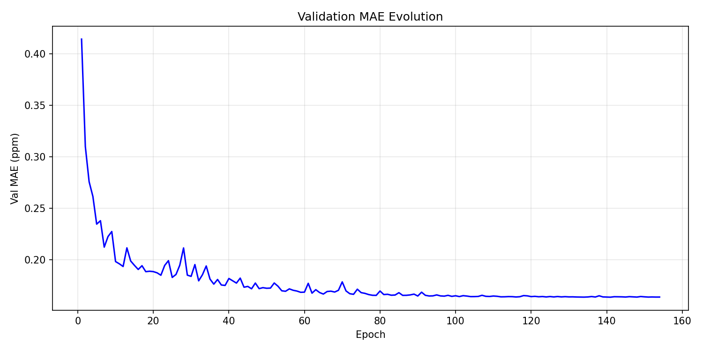
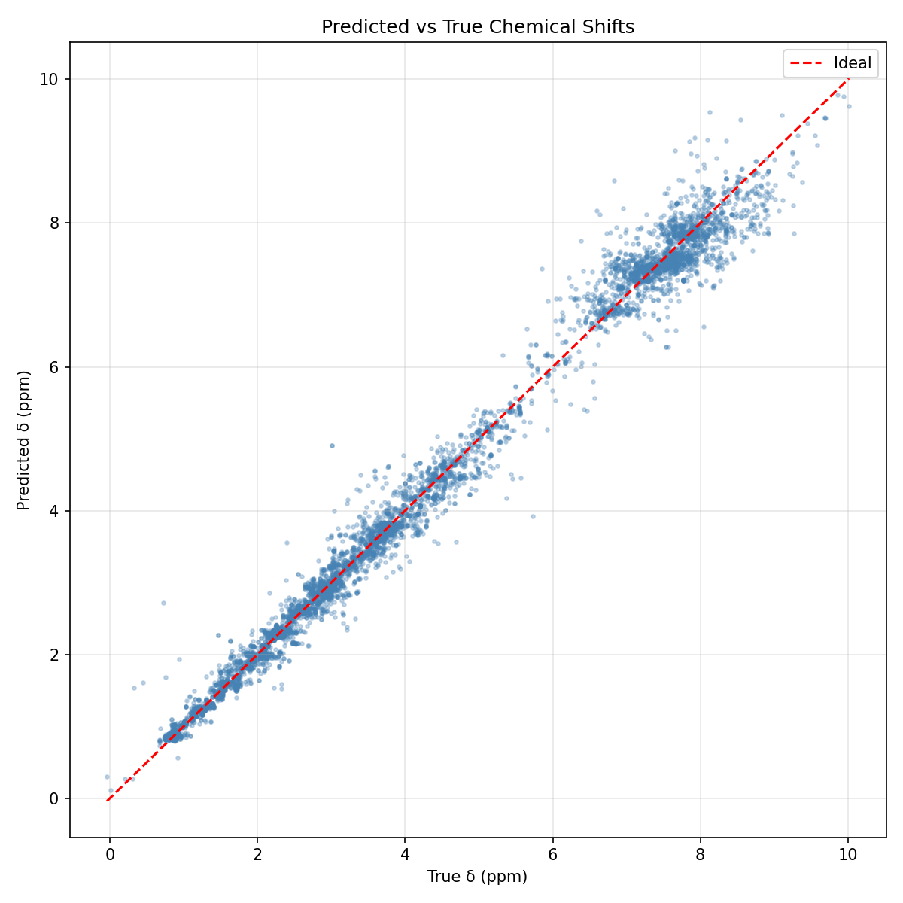
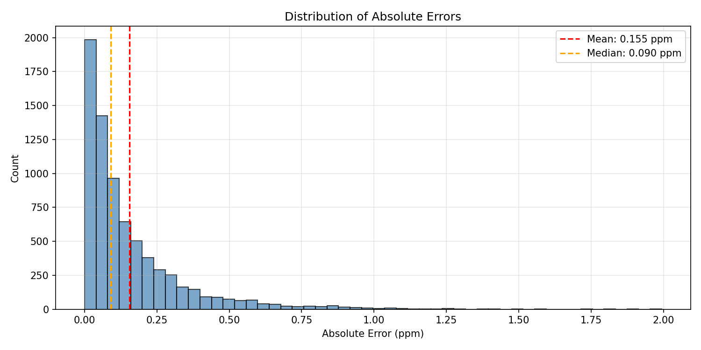

# Proton NMR Chemical Shift Predictor and Spectrum Simulator

A machine learning pipeline for predicting ¹H-NMR chemical shifts (δ, ppm) from molecular structures using SMILES notation and molfile data.

## Overview

This project implements an end-to-end machine learning system for predicting proton (¹H) NMR chemical shifts from molecular structure data. Nuclear Magnetic Resonance (NMR) spectroscopy is one of the most powerful techniques for molecular structure determination in chemistry. The chemical shift (δ) of a proton is highly sensitive to its local electronic environment, making it a valuable descriptor for structure elucidation.

The approach takes advantage of the fact that chemical shifts are primarily determined by the local electronic environment around each proton. By extracting relevant molecular descriptors and training a neural network on experimental data, we can predict the expected chemical shift for any proton in a molecule given its 3D structure.

The pipeline consists of three main stages: **feature extraction** (computing molecular descriptors for each proton), **model training** (training a Multi-Layer Perceptron to learn the relationship between features and chemical shifts), and **prediction** (using the trained model to predict shifts for new molecules).

## Scientific Background

### Nuclear Magnetic Resonance (NMR) Spectroscopy

NMR spectroscopy exploits the magnetic properties of atomic nuclei. When placed in a strong magnetic field, nuclei with non-zero spin (like ¹H) absorb electromagnetic radiation at characteristic frequencies. The **chemical shift** (δ) measures how much the resonance frequency of a nucleus differs from a reference compound (typically TMS - tetramethylsilane), expressed in parts per million (ppm).

The chemical shift is influenced by the electron density around the nucleus. Electrons shield the nucleus from the external magnetic field, so protons in electron-rich environments resonate at lower frequencies (upfield, lower ppm), while protons in electron-poor environments resonate at higher frequencies (downfield, higher ppm).

### Factors Affecting Chemical Shift

Several factors determine the chemical shift of a proton:

**Electronegativity of nearby atoms** is perhaps the most important factor. Electronegative atoms like oxygen, nitrogen, fluorine, and chlorine withdraw electron density from neighboring protons, deshielding them and causing downfield shifts. This effect diminishes with distance but can still be significant at 2-3 bonds away.

**Hybridization** of the parent atom affects electron distribution. Protons attached to sp² carbons (in alkenes or aromatic rings) typically appear at different chemical shifts than those on sp³ carbons due to differences in electronegativity and magnetic anisotropy effects.

**Aromaticity** introduces ring current effects. The circulation of π-electrons in aromatic systems creates a local magnetic field that significantly deshields protons on the ring periphery, shifting them downfield to the 6.5-8.5 ppm region.

**Hydrogen bonding** can cause variable shifts depending on conditions. Protons involved in hydrogen bonds are typically deshielded and appear downfield, but the exact position depends on the strength and dynamics of the hydrogen bond.

### Typical Chemical Shift Ranges

Different types of protons appear in characteristic regions of the spectrum:

| Proton Type | δ Range (ppm) |
|-------------|---------------|
| Alkyl (R-CH₃) | 0.5 - 1.5 |
| Allylic (C=C-CH) | 1.5 - 2.5 |
| α to carbonyl (C=O-CH) | 2.0 - 2.5 |
| α to nitrogen (N-CH) | 2.2 - 3.0 |
| α to oxygen (O-CH) | 3.3 - 4.5 |
| Vinylic (C=CH) | 4.5 - 6.5 |
| Aromatic (Ar-H) | 6.5 - 8.5 |
| Aldehyde (CHO) | 9.0 - 10.0 |
| Carboxylic acid (COOH) | 10.0 - 12.0 |

## Installation

### Prerequisites

- Python 3.12+
- CUDA-compatible GPU (optional, for faster training)

### Setup

Clone the repository and install the required dependencies:

```bash
git clone https://github.com/antonio-lopez-lao-all825/building-a-spectrum-predictor-from-smiles.git
cd building-a-spectrum-predictor-from-smiles
python -m venv .venv
source .venv/bin/activate
pip install -r requirements.txt
```

The main dependencies are NumPy, PyTorch, scikit-learn, Matplotlib, and RDKit. RDKit can be installed via conda (`conda install -c conda-forge rdkit`) or pip (`pip install rdkit`).

## Usage

### 1. Feature Extraction & Dataset Building

The first step is to extract molecular features from the raw NMR data. The input data consists of JSON files containing the molecular structure (as a molfile) and experimental chemical shifts for each proton.

```bash
python build_dataset.py --input_dir data/nmr_predictions
```

This script processes each molecule by parsing its 3D structure, identifying all protons, and computing 21 molecular descriptors for each one. The descriptors encode information about the local chemical environment: the parent atom's properties (atomic number, hybridization, charge), the neighborhood composition (counts and charges of atoms at 2-bond distance), and geometric features (distances to neighboring atoms).

The output is a compressed NumPy file (`datasets/proton_dataset.npz`) containing the normalized feature matrix, target chemical shifts, and normalization parameters needed for inference.

### 2. Model Training

Once the dataset is built, train the neural network:

```bash
python train.py
```

The training script loads the preprocessed dataset, splits it into training (80%) and validation (20%) sets, and trains a Multi-Layer Perceptron. The model architecture consists of two hidden layers (128 and 64 neurons) with ReLU activations, outputting a single chemical shift value.

Training uses the Huber loss function, which combines the benefits of mean squared error (smooth gradients near the optimum) and mean absolute error (robustness to outliers). This is particularly suitable for NMR data where some chemical shifts may have measurement uncertainty.

The optimizer is AdamW with a learning rate scheduler that reduces the learning rate when validation MAE plateaus. Early stopping prevents overfitting by halting training if no improvement is seen for 20 consecutive epochs.

The trained model weights are saved to `proton_mlp.pt`, and training visualizations are generated in the `training_plots/` directory.

### 3. Prediction

To predict chemical shifts for a new molecule:

```bash
python predict.py "CCO"  # Ethanol example
python predict.py "c1ccccc1" --b0 600.0 --linewidth 0.5  # Benzene with custom settings
```

The prediction script loads the molecule's JSON file (which must exist in the data directory), extracts features for each proton using the same procedure as during training, normalizes them with the saved parameters, and runs inference through the trained model.

Output files are saved to `data/predicted_json/` (JSON with predicted shifts) and `data/predicted_plots/` (comparison plot of original vs predicted spectrum).

## Feature Engineering

The `features.py` module extracts 21 molecular descriptors for each proton attached to any heavy atom (C, N, O, etc.). These features encode the local chemical environment that determines the chemical shift.

The features can be grouped into several categories:

**Parent atom properties** include the atomic number (distinguishing C-H from N-H or O-H protons), degree (number of bonds), total hydrogen count, formal charge, aromaticity flag, and hybridization state (sp, sp², or sp³).

**Electronic properties** are captured through Gasteiger partial charges. We compute the charge on the parent atom as well as statistics (mean, max, min) of charges on atoms at 2-bond distance. These charges reflect electron density distribution and correlate strongly with chemical shift.

**Neighborhood composition** is described by counting atoms at 2-bond distance: carbons, oxygens, nitrogens, and aromatic atoms. The presence of electronegative neighbors or aromatic systems significantly affects the chemical shift.

**Structural features** indicate whether the proton is adjacent to a π-system (double bond or aromatic ring) and whether it's in a rigid environment (ring or double bond). Rigidity affects conformational averaging of the chemical shift.

**Geometric features** use the 3D coordinates from the molfile to compute distances to neighboring atoms. These capture steric effects and provide information about the molecular geometry.

All features are normalized to the [0, 1] range using min-max scaling, with parameters saved during training for consistent application during inference.

## Model Architecture

The model is a straightforward Multi-Layer Perceptron with the following structure:

- **Input layer**: 21 features
- **Hidden layer 1**: 128 neurons with ReLU activation
- **Hidden layer 2**: 64 neurons with ReLU activation  
- **Output layer**: 1 neuron (predicted chemical shift in ppm)

This architecture was chosen for its simplicity and effectiveness. The two hidden layers provide enough capacity to learn the nonlinear relationship between molecular features and chemical shifts, while the relatively small size prevents overfitting and enables fast training and inference.

### Training Configuration

| Parameter | Value |
|-----------|-------|
| Loss Function | Huber Loss |
| Optimizer | AdamW |
| Learning Rate | 1e-3 (initial) |
| LR Scheduler | ReduceLROnPlateau (factor=0.5) |
| Batch Size | 128 |
| Max Epochs | 300 |
| Early Stopping | 20 epochs patience |

## Data Format

Each JSON file contains NMR data for one molecule:

```json
{
  "molfile": "... MDL Molfile V2000/V3000 ...",
  "smiles": "CCO",
  "nucleus": "1H",
  "signals": [
    {
      "id": "unique-signal-id",
      "delta": 3.65,
      "nbAtoms": 2,
      "atoms": [4, 5],
      "multiplicity": "q"
    }
  ]
}
```

The `molfile` field contains the 3D molecular structure in MDL format, which is essential for computing geometric features. The `signals` array contains the experimental NMR data, with `delta` being the chemical shift in ppm and `atoms` listing the atom indices (from the molfile) that correspond to this signal.

## Results

The model is evaluated using Mean Absolute Error (MAE), which represents the average absolute difference between predicted and experimental chemical shifts in ppm.

### Training Results

The following plots show the model's performance during training:

#### Validation MAE Evolution

The validation MAE decreases steadily during training before plateauing, indicating successful learning without overfitting:



#### Predicted vs True Chemical Shifts

The scatter plot shows good agreement between predicted and experimental values across the full chemical shift range. Points cluster tightly around the diagonal line, indicating accurate predictions:



#### Error Distribution

The histogram of absolute errors shows that most predictions have small errors, with the distribution skewed towards zero:



## Limitations and Future Work

### Current Limitations

The current model has several limitations that could be addressed in future work:

**Limited feature set**: While 21 features capture the essential local environment, they may miss long-range effects such as ring current anisotropy from distant aromatic groups or through-space interactions in folded conformations.

**No coupling prediction**: The model only predicts chemical shifts, not J-coupling constants. Coupling information is valuable for structure elucidation and would require additional features and possibly a multi-task learning approach.

**Solvent effects**: Chemical shifts can vary significantly depending on the solvent, particularly for exchangeable protons. The model does not account for these effects.

### Potential Improvements

Several directions could improve the model:

**Graph Neural Networks** could replace the MLP to operate directly on the molecular graph, learning optimal features automatically rather than relying on hand-crafted descriptors.

**Attention mechanisms** could help the model learn which neighboring atoms most strongly influence each proton's chemical shift.

**Transfer learning** from large computational datasets (DFT-calculated chemical shifts) could improve predictions, especially for underrepresented chemical environments.

**Uncertainty quantification** through dropout at inference time or ensemble methods would provide confidence estimates for predictions.