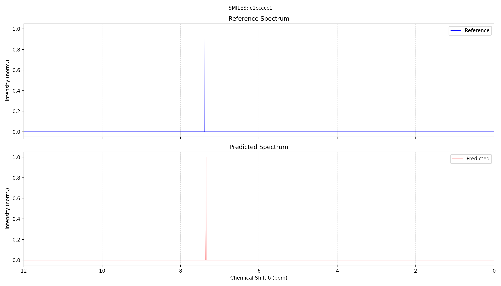

# Proton NMR Chemical Shift Predictor and Spectrum Simulator

A machine learning pipeline for predicting ¹H-NMR chemical shifts (δ, ppm) from molecular structures using SMILES notation.

## Overview

This project implements an end-to-end machine learning system for predicting proton (¹H) NMR chemical shifts from molecular structure data. Nuclear Magnetic Resonance (NMR) spectroscopy is one of the most powerful techniques for molecular structure determination in chemistry. The chemical shift (δ) of a proton is highly sensitive to its local electronic environment, making it a valuable descriptor for structure elucidation.

The approach takes advantage of the fact that chemical shifts are primarily determined by the local electronic environment around each proton. By extracting relevant molecular descriptors and training a neural network on experimental data, we can predict the expected chemical shift for any proton in a molecule given its SMILES string.

The pipeline consists of three main stages: **feature extraction** (computing molecular descriptors for each proton), **model training** (training a Multi-Layer Perceptron), and **prediction** (generating and visualizing predicted spectra for new molecules).

## Scientific Background

### Nuclear Magnetic Resonance (NMR) Spectroscopy

NMR spectroscopy exploits the magnetic properties of atomic nuclei. When placed in a strong magnetic field, nuclei with non-zero spin (like ¹H) absorb electromagnetic radiation at characteristic frequencies. The **chemical shift** (δ) measures how much the resonance frequency of a nucleus differs from a reference compound (typically TMS - tetramethylsilane), expressed in parts per million (ppm).

The chemical shift is influenced by the electron density around the nucleus. Electrons shield the nucleus from the external magnetic field, so protons in electron-rich environments resonate at lower frequencies (upfield, lower ppm), while protons in electron-poor environments resonate at higher frequencies (downfield, higher ppm).

### Factors Affecting Chemical Shift

Several factors determine the chemical shift of a proton:

**Electronegativity of nearby atoms** is perhaps the most important factor. Electronegative atoms like oxygen, nitrogen, fluorine, and chlorine withdraw electron density from neighboring protons, deshielding them and causing downfield shifts. This effect diminishes with distance but can still be significant at 2-3 bonds away.

**Hybridization** of the parent atom affects electron distribution. Protons attached to sp² carbons (in alkenes or aromatic rings) typically appear at different chemical shifts than those on sp³ carbons due to differences in electronegativity and magnetic anisotropy effects.

**Aromaticity** introduces ring current effects. The circulation of π-electrons in aromatic systems creates a local magnetic field that significantly deshields protons on the ring periphery, shifting them downfield to the 6.5-8.5 ppm region.

**Hydrogen bonding** can cause variable shifts depending on conditions. Protons involved in hydrogen bonds are typically deshielded and appear downfield, but the exact position depends on the strength and dynamics of the hydrogen bond.

### Typical Chemical Shift Ranges

Different types of protons appear in characteristic regions of the spectrum:

| Proton Type | δ Range (ppm) |
|-------------|---------------|
| Alkyl (R-CH₃) | 0.5 - 1.5 |
| Allylic (C=C-CH) | 1.5 - 2.5 |
| α to carbonyl (C=O-CH) | 2.0 - 2.5 |
| α to nitrogen (N-CH) | 2.2 - 3.0 |
| α to oxygen (O-CH) | 3.3 - 4.5 |
| Vinylic (C=CH) | 4.5 - 6.5 |
| Aromatic (Ar-H) | 6.5 - 8.5 |
| Aldehyde (CHO) | 9.0 - 10.0 |
| Carboxylic acid (COOH) | 10.0 - 12.0 |

## Installation

### Prerequisites

- Python 3.12+
- Python Virtual Environment package
- CUDA-compatible GPU (optional, for faster training)

### Setup

Clone the repository and install the required dependencies:

```bash
git clone https://github.com/antonio-lopez-lao-all825/building-a-spectrum-predictor-from-smiles.git
cd building-a-spectrum-predictor-from-smiles
python -m venv .venv
source .venv/bin/activate
pip install -r requirements.txt
```

The main dependencies are NumPy, PyTorch, scikit-learn, Matplotlib, and RDKit.

## Usage

### 1. Feature Extraction & Dataset Building

Extract molecular features from the NMR data:

```bash
python build_dataset.py --input_dir data/nmr_predictions_balanced
```

This script processes each molecule by parsing its 3D structure, identifying all protons, and computing 21 molecular descriptors for each one. The output is a compressed NumPy file (`datasets/proton_dataset.npz`) containing the normalized feature matrix, target chemical shifts, and normalization parameters needed for inference. The current dataset contains **36,987 proton samples**.

### 2. Model Training

Once the dataset is built, train the neural network:

```bash
python train.py
```

The training script loads the preprocessed dataset, splits it into training (80%) and validation (20%) sets, and trains a Multi-Layer Perceptron. Training uses Huber loss, AdamW optimizer, and a learning rate scheduler that reduces the learning rate when validation MAE plateaus. Early stopping prevents overfitting by halting training if no improvement is seen for 20 consecutive epochs.

The trained model weights are saved to `proton_mlp.pt`, and training visualizations are generated in the `training_plots/` directory.

### 3. Prediction

To predict chemical shifts and generate a comparison spectrum for a new molecule:

```bash
python predict.py "CCO"                              # Ethanol
python predict.py "c1ccccc1" --b0 600.0 --linewidth 0.5  # Benzene at 600 MHz
```

If a JSON file for the SMILES already exists locally in `data/nmr_predictions_balanced/`, it is loaded directly. Otherwise, the script automatically fetches NMR reference data from the [Zakodium API](https://nmr-prediction.service.zakodium.com) and saves it locally for future use.

Output files:
- `data/predicted_json/<smiles>_pred.json` — JSON with predicted chemical shifts
- `tests/<smiles>.png` — comparison plot of reference vs predicted spectrum

#### Comparison plot example (benzene)

The plot shows the reference spectrum (top, blue) and the predicted spectrum (bottom, red):



## Feature Engineering

The `features.py` module extracts 21 molecular descriptors for each proton attached to any heavy atom (C, N, O, S, P). These features encode the local chemical environment that determines the chemical shift.

| # | Feature | Physical Meaning |
|---|---------|-----------------|
| 1 | `parent_atomic_num` | Identifies C-H, N-H, O-H etc. |
| 2 | `degree` | Connectivity, affects inductive effects |
| 3 | `total_num_Hs` | Number of equivalent protons |
| 4 | `formal_charge` | Charge affects shielding |
| 5 | `is_aromatic` | Ring current effects |
| 6 | `hyb_sp` | Triple bond / terminal alkyne |
| 7 | `hyb_sp2` | Double bond / aromatic |
| 8 | `hyb_sp3` | Saturated carbon |
| 9 | `gasteiger_charge` | Electronegativity equalization |
| 10 | `mean_charge_2bonds` | Average electron density at 2 bonds |
| 11 | `max_charge_2bonds` | Most positive neighbor at 2 bonds |
| 12 | `min_charge_2bonds` | Most negative neighbor at 2 bonds |
| 13 | `n_C_2bonds` | Carbon count at 2-bond distance |
| 14 | `n_O_2bonds` | Oxygen count (deshielding) at 2 bonds |
| 15 | `n_N_2bonds` | Nitrogen count at 2 bonds |
| 16 | `n_aromatic_2bonds` | Aromatic atoms at 2-bond distance |
| 17 | `bonded_to_pi` | Adjacent to double bond or aromatic ring |
| 18 | `rigid_environment` | In ring or double bond |
| 19 | `mean_neighbor_distance` | Average bond length (Å) |
| 20 | `min_neighbor_distance` | Shortest bond (Å) |
| 21 | `max_neighbor_distance` | Longest bond (Å) |

All features are normalized to the [0, 1] range using min-max scaling, with parameters saved during training for consistent application during inference.

## Model Architecture

The model is a Multi-Layer Perceptron with the following structure:

```
Input (21) → Linear(128) → ReLU → Linear(64) → ReLU → Linear(1)
```

This architecture provides enough capacity to learn the nonlinear relationship between molecular features and chemical shifts, while remaining small enough to avoid overfitting and enable fast inference.

### Training Configuration

| Parameter | Value |
|-----------|-------|
| Loss Function | Huber Loss |
| Optimizer | AdamW |
| Learning Rate | 1e-3 (initial) |
| LR Scheduler | ReduceLROnPlateau (factor=0.5, patience=5) |
| Batch Size | 128 |
| Max Epochs | 300 |
| Early Stopping | 20 epochs patience |

## Data Format

Each JSON file contains NMR data for one molecule in the format returned by the Zakodium API:

```json
{
  "molfile": "... MDL Molfile V2000/V3000 ...",
  "nucleus": "1H",
  "signals": [
    {
      "id": "unique-signal-id",
      "delta": 3.65,
      "nbAtoms": 2,
      "atoms": [4, 5],
      "js": [
        {"coupling": 7.1, "multiplicity": 3}
      ]
    }
  ]
}
```

The `molfile` field contains the 3D molecular structure in MDL format, essential for computing geometric features. The `atoms` field lists the **hydrogen atom indices** in the molfile that correspond to the signal. The `js` array encodes J-coupling constants used to simulate multiplet patterns in the spectrum.

## Results

The model is evaluated using Mean Absolute Error (MAE) and the coefficient of determination (R²).

### Training Curves

#### Validation MAE Evolution


#### Validation R² Evolution


#### Predicted vs True Chemical Shifts


## Project Structure

```
.
├── build_dataset.py         # Extract features → datasets/proton_dataset.npz
├── features.py              # Shared feature extraction (21 descriptors)
├── train.py                 # Train MLP → proton_mlp.pt
├── predict.py               # Predict shifts + generate comparison PNG
├── proton_mlp.pt            # Trained model weights
├── requirements.txt
├── data/
│   ├── nmr_predictions_balanced/ # NMR JSON files (1,648 molecules)
│   └── predicted_json/           # Output predictions (_pred.json)
├── datasets/
│   └── proton_dataset.npz        # Preprocessed dataset (36,987 protons, 21 features)
├── training_plots/               # Training metric plots
└── tests/                        # Comparison spectrum PNGs
```

## Limitations and Future Work

### Current Limitations

**Limited feature set**: While 21 features capture the essential local environment, they may miss long-range effects such as ring current anisotropy from distant aromatic groups or through-space interactions in folded conformations.

**No coupling prediction**: The model only predicts chemical shifts, not J-coupling constants. The J-couplings shown in predicted spectra are taken directly from the reference data.

**Solvent effects**: Chemical shifts can vary significantly depending on the solvent, particularly for exchangeable protons (N-H, O-H). The model does not account for these effects.

### Potential Improvements

**Graph Neural Networks** could replace the MLP to operate directly on the molecular graph, learning optimal features automatically rather than relying on hand-crafted descriptors.

**Attention mechanisms** could help the model learn which neighboring atoms most strongly influence each proton's chemical shift.

**Transfer learning** from large computational datasets (DFT-calculated chemical shifts) could improve predictions, especially for underrepresented chemical environments.

**Uncertainty quantification** through dropout at inference time or ensemble methods would provide confidence estimates for predictions.
